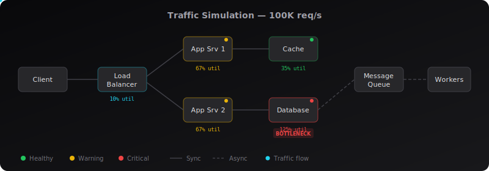

<div align="center">

<a href="https://github.com/saakshigupta2002/system-design">
  
</a>

<br/><br/>

[](https://nextjs.org)
[](https://react.dev)
[](https://typescriptlang.org)
[](https://tailwindcss.com)
[](https://reactflow.dev)

**The open-source system design interview simulator.**<br/>
**Build architectures. Simulate traffic. Get scored. Pass interviews.**

[Getting Started](#quick-start) &nbsp;&middot;&nbsp; [Features](#features) &nbsp;&middot;&nbsp; [49 Problems](#49-design-problems) &nbsp;&middot;&nbsp; [Contributing](#contributing)

</div>

---

## Why SystemDesign?

Most system design prep is passive — reading articles, watching videos. SystemDesign is **active practice**. You drag real infrastructure components onto a canvas, wire them together, simulate production-scale traffic, and get scored the way an interviewer would evaluate you.

It's the flight simulator for system design interviews.

---

## Features

<div align="center">
  
</div>

<br/>

<table>
<tr>
<td width="50%">

### 100+ Components, mapped to canonical roles

Every building block you need — generic boxes, cloud-branded, and real products:

**Networking** — DNS, CDN, Load Balancer, API Gateway, Rate Limiter, Reverse Proxy, Origin Shield

**Compute** — App Server, Auth Service, WebSocket Server, Worker, Task Scheduler, Stream Processor, Notification Service

**Storage** — SQL DB, NoSQL DB, Cache, Object Storage, Search, Graph DB, Time-Series DB, Data Warehouse, Vector DB, Geospatial Index, File Store

**Infrastructure** — Message Queue, Pub/Sub, Service Mesh, Monitoring, Service Discovery, Distributed Lock, Circuit Breaker, Coordination Service, Config Service, ID Generator, Sharded Counter

**Brands & clouds** — Redis, Kafka, Nginx, PostgreSQL, Cassandra, Elasticsearch, Prometheus, plus AWS / GCP / SaaS / AI building blocks

**Special** — Custom Component (double-click to rename to anything)

Every component resolves to a **canonical role** (Redis → cache, Kafka → queue,
Nginx → load balancer), so the simulator and scorer reward what a component
*does* — a realistic branded design scores like its generic equivalent, not
worse. See [`src/data/roles.ts`](src/data/roles.ts).

</td>
<td width="50%">

### Realistic Specs

Every component has **verified benchmarks**:

| Component | Max QPS | Latency |
|-----------|---------|---------|
| Load Balancer | 1,000,000 | 1ms |
| Cache/Redis | 100,000 | 1ms |
| SQL Database | 10,000 | 8ms |
| NoSQL (DynamoDB) | 50,000 | 3ms |
| Kafka | 100,000 | 5ms |
| Elasticsearch | 20,000 | 10ms |
| Object Storage (S3) | 25,000 | 75ms |
| CDN | 500,000 | 15ms |

All values cross-checked against official docs and benchmarks.

</td>
</tr>
</table>

---

### Traffic Simulation

<div align="center">
  
</div>

<br/>

- **Kahn's topological sort** for correct fan-in QPS accumulation
- **Smart traffic splitting** — Load balancers split evenly; other components fan-out 100% to each child
- **Per-node metrics** — QPS, utilization %, latency, status (healthy / warning / critical)
- **Bottleneck detection** with cascading failure visualization
- **Cycle detection** with warnings
- **Configurable load** — 1K to 500K requests/sec

---

### 5-Category Scoring

<div align="center">
  
</div>

<br/>

Scored like a real interview — across the 5 dimensions interviewers evaluate:

| Category | What it checks |
|----------|---------------|
| **Scalability** | Load balancing, horizontal scaling, caching, async — plus **sustains the problem's required req/s** in simulation |
| **Availability** | No SPOFs, replica redundancy, monitoring, overload protection |
| **Latency** | CDN, cache-before-DB patterns — plus **meets the problem's latency SLA** in simulation |
| **Cost Efficiency** | Right-sized components, polyglot persistence, no waste |
| **Trade-offs** | Read/write separation, defense in depth, architecture breadth |

**Problem-aware:** when a built-in problem is selected, your design is simulated
at the problem's actual load (reads + writes per second) and graded against its
stated latency SLA and throughput target — not a generic checklist. The score
report also diffs your design against the reference solution **by role**, so
Redis counts as the cache the reference asked for.

Verdicts: **Needs Work** < 31 | **Decent** < 51 | **Good** < 71 | **Excellent** < 86 | **Architect Level** 86+

---

### Interview Practice Mode

<div align="center">
  
</div>

<br/>

Practice like a real 45-minute interview:

1. **Requirements** (5 min) — Clarify functional and non-functional requirements
2. **Estimation** (5 min) — Back-of-envelope calculations
3. **API Design** (5 min) — Define core REST endpoints
4. **Data Model** (5 min) — Design entities and relationships
5. **High-Level Design** (15 min) — Build the architecture on canvas
6. **Deep Dive** (10 min) — Discuss trade-offs and failure modes

Color-coded timer: green (on track) | yellow (over target) | red (significantly over)

---

### Edge Labels & Protocol Types

Label every connection with its protocol and communication style:

| Protocol | Style | Example |
|----------|-------|---------|
| HTTP | Solid line | App Server -> Database |
| gRPC | Solid + purple badge | Service -> Service |
| WebSocket | Solid + green badge | Client -> WS Server |
| pub/sub | Dashed + amber badge | Queue -> Consumer |
| TCP | Solid + zinc badge | Cache -> App Server |

Click any edge to set protocol, sync/async mode, and a custom label.

---

### Concept Library

Select any component to learn:

- **When to use** — concrete scenarios where this component shines
- **When NOT to use** — common mistakes to avoid
- **Key trade-offs** — engineering considerations
- **Interview tips** — what to say to impress interviewers
- **Common patterns** — Cache-aside, Write-through, etc.
- **Real-world examples** — verified facts from Netflix, Twitter, Uber, etc.

---

### Trade-off Decision Log

14 pre-built trade-off cards with side-by-side comparisons:

SQL vs NoSQL | Push vs Pull | Sync vs Async | Strong vs Eventual Consistency | Monolith vs Microservices | REST vs gRPC | Cache-aside vs Write-through | Vertical vs Horizontal Scaling | Polling vs WebSocket | Single vs Multi-leader | Hash vs Range Partitioning | CDN Push vs Pull | Token Bucket vs Sliding Window | At-least-once vs Exactly-once

Log your own decisions with rationale during practice.

---

### Learning Path

Structured progression from beginner to expert:

| Tier | Problems | Focus |
|------|----------|-------|
| **Foundations** | URL Shortener, Rate Limiter, Parking Lot | Core building blocks |
| **Intermediate** | Notification System, Autocomplete, Instagram, Spotify, Distributed Cache | Combining systems |
| **Advanced** | Twitter, Chat, Web Crawler, Dropbox, E-Commerce | Complex distributed systems |
| **Expert** | Uber, YouTube, Payment, Ticketmaster, Google Docs, Slack, Monitoring, Netflix, Zoom, Google Maps, WhatsApp, TikTok, Kafka, etc. | Multi-concern architectures |

Track completion with checkboxes. Concept prerequisites shown per problem.

---

## 49 Design Problems

<details>
<summary><strong>Click to see selected problems (49 total, including AI/LLM systems)</strong></summary>

| # | Problem | Difficulty | Key Concepts |
|---|---------|-----------|-------------|
| 1 | URL Shortener | Easy | Hashing, caching, 100:1 read/write |
| 2 | Rate Limiter | Easy | Token bucket, sliding window, Redis |
| 3 | Parking Lot | Easy | IoT events, availability tracking |
| 4 | Twitter / News Feed | Hard | Fan-out, timeline, hybrid approach |
| 5 | Chat System | Hard | WebSocket, presence, message ordering |
| 6 | Uber / Ride Sharing | Hard | Geohash, location streaming, matching |
| 7 | YouTube / Video Streaming | Hard | CDN, transcoding, tiered storage |
| 8 | Notification System | Medium | Priority queues, multi-channel delivery |
| 9 | Typeahead / Autocomplete | Medium | Trie, prefix search, offline aggregation |
| 10 | Web Crawler | Medium | URL frontier, politeness, dedup |
| 11 | Distributed Cache | Medium | Consistent hashing, eviction, hot keys |
| 12 | Payment System | Hard | Idempotency, saga pattern, double-entry ledger |
| 13 | Ticket Booking | Hard | Virtual queue, seat locking, flash sales |
| 14 | Google Docs | Hard | OT/CRDT, WebSocket, version history |
| 15 | Dropbox / File Storage | Hard | Block chunking, delta sync, dedup |
| 16 | Instagram | Medium | Media pipeline, feed gen, CDN strategy |
| 17 | Spotify | Medium | Adaptive bitrate, pre-fetch, collab filtering |
| 18 | Amazon / E-Commerce | Hard | Microservices, inventory, event sourcing |
| 19 | Slack / Team Messaging | Hard | Channel model, search, connection gateway |
| 20 | Metrics / Monitoring | Hard | Time-series ingestion, downsampling, alerting |
| 21 | Netflix | Hard | Recommendation engine, adaptive streaming, DRM |
| 22 | Tinder / Dating App | Medium | Geospatial matching, ELO scoring, Bloom filters |
| 23 | Google Maps | Hard | Map tiles, Dijkstra/A*, real-time traffic |
| 24 | Zoom | Hard | WebRTC/SFU, simulcast, screen sharing |
| 25 | DoorDash / Food Delivery | Hard | Driver dispatch, ETA prediction, order tracking |
| 26 | Reddit | Medium | Ranking algorithms, comment trees, moderation |
| 27 | Airbnb | Hard | Search + booking, pricing, bilateral reviews |
| 28 | WhatsApp | Hard | E2E encryption (Signal Protocol), offline delivery |
| 29 | Google Search | Hard | Inverted index, PageRank, query parsing |
| 30 | Yelp / Location Service | Medium | QuadTree/Geohash, proximity search, reviews |
| 31 | TikTok | Hard | Recommendation (two-tower), video transcoding |
| 32 | Distributed Message Queue | Hard | Partitioning, consumer groups, exactly-once |
| 33 | Digital Wallet / UPI | Hard | P2P transfers, idempotency, compliance |
| 34 | Online Code Editor | Medium | Sandboxed execution, LSP, real-time collab |
| 35 | CI/CD Pipeline | Medium | Build DAGs, artifact storage, canary deploys |

</details>

Each problem includes requirements (QPS, storage, latency), constraints, progressive hints, tags, and a reference architecture.

---

## Quick Start

```bash
git clone https://github.com/saakshigupta2002/system-design.git
cd system-design
npm install
npm run dev
```

Open **http://localhost:3000**

### Keyboard Shortcuts

| Shortcut | Action |
|----------|--------|
| `Ctrl+Enter` | Run simulation |
| `Ctrl+Shift+S` | Score design |
| `Ctrl+S` | Save design |
| `Ctrl+O` | Load design |
| `Ctrl+E` | Export as PNG |
| `Delete` | Remove selected node |
| `Escape` | Deselect |

---

## Tech Stack

| Layer | Technology |
|-------|-----------|
| Framework | Next.js 16 (App Router) |
| UI | React 19 + TypeScript |
| Canvas | @xyflow/react (ReactFlow v12) |
| State | Zustand v5 (persisted to localStorage) |
| Styling | Tailwind CSS v4 + shadcn/ui |
| Animation | Framer Motion |
| Icons | Lucide React |
| Export | html-to-image |

## Project Structure

```
src/
├── app/                    # Next.js app router
├── components/
│   ├── canvas/             # ReactFlow canvas, nodes (Component + Text), edges
│   ├── dialogs/            # Save/Load dialogs
│   ├── interview/          # Interview mode (bar, phases, guides)
│   ├── layout/             # AppShell, TopBar
│   ├── panel/              # Right panel (props, sim, score, capacity, trade-offs)
│   ├── sidebar/            # Left sidebar (components, problems, learning path)
│   └── ui/                 # shadcn/ui primitives
├── data/
│   ├── components.ts       # 100+ components (generic + cloud + brand) with specs
│   ├── roles.ts            # Component → canonical role map (sim/scorer key off this)
│   ├── problems.ts         # 49 design problems with reference architectures
│   ├── conceptLibrary.ts   # Educational content for the core components
│   ├── interviewData.ts    # Requirements, APIs, data models for the problems
│   ├── tradeoffCards.ts    # Pre-built trade-off comparisons
│   └── learningPath.ts     # Tiered progression with prerequisites
├── engine/
│   └── simulator.ts        # Traffic simulation (Kahn's topological sort, role-aware)
├── scoring/
│   ├── scorer.ts           # Main scoring orchestrator
│   └── rules/              # 5 scoring rule modules (20 pts each)
├── store/
│   ├── appStore.ts         # UI state (persisted)
│   ├── canvasStore.ts      # Nodes & edges (persisted to localStorage)
│   ├── simulationStore.ts  # Simulation config & results
│   ├── savedDesignsStore.ts# Named design saves
│   ├── interviewStore.ts   # Interview mode & timer
│   └── tradeoffStore.ts    # Trade-off decision log
└── types/                  # TypeScript interfaces
```

---

## ☕ Support

If SystemDesign helped you prep for a system design interview, your support goes a long way to keep it alive and open-source. No pressure — no ads, no paywalls.

> Payment details coming soon.

---

## Contributing

Contributions welcome. Please open an issue first to discuss.

```bash
npm run dev       # Start dev server
npm run build     # Production build
npm run lint      # Run ESLint
```

## License

[MIT](LICENSE)

---

<div align="center">

Built by [@saakshigupta2002](https://github.com/saakshigupta2002)

**Star this repo if it helps your interview prep.**

</div>
